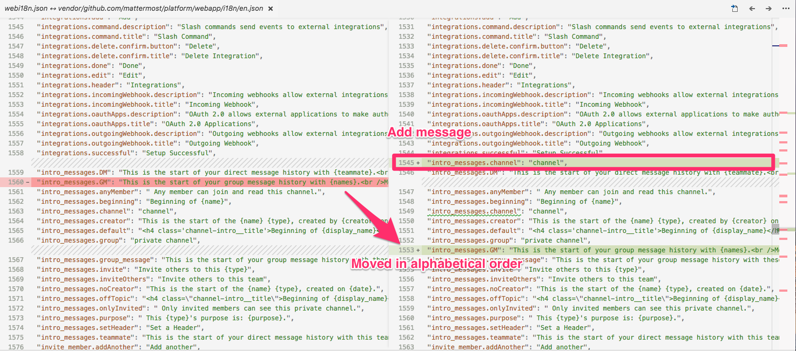

## Usage

```
glide install
go run *.go
```

Output `serveri18n.json` and `webi18n.json` to current directory.
These files are files with `i18n/en.json` and `webapp/i18n/en.json` modified respectively.

Modifications are the follow.
* **added** messages that are written in source code but were not written in `en.json`
* **removed** messages that were not written in source code

You can see wrong part of message by using any diff tools.

Example(VS Code): 



## Caution

When parsing JSX files, errors often occur, then incorrect message entities are written in `webi18n.json`.

```
  "admin.connectionSecurityStart')}\n                ]}\n                label={\n                    <FormattedMessage\n                        id='admin.connectionSecurityTitle'\n                        defaultMessage='Connection Security:'\n                    />\n                }\n                value={this.props.value}\n                onChange={this.props.onChange}\n                disabled={this.props.disabled}\n                helpText={CONNECTION_SECURITY_HELP_TEXT_EMAIL}\n            />\n        );\n    }\n}\nConnectionSecurityDropdownSettingEmail.defaultProps = {\n};\n\nConnectionSecurityDropdownSettingEmail.propTypes = {\n    value: React.PropTypes.string.isRequired,\n    onChange: React.PropTypes.func.isRequired,\n    disabled: React.PropTypes.bool.isRequired\n};\n\nexport class ConnectionSecurityDropdownSettingLdap extends React.Component { //eslint-disable-line react/no-multi-comp\n    render() {\n        return (\n            <DropdownSetting\n                id='connectionSecurity'\n                values={[\n                    {value: '', text: Utils.localizeMessage('admin.connectionSecurityNone": "Non",
```